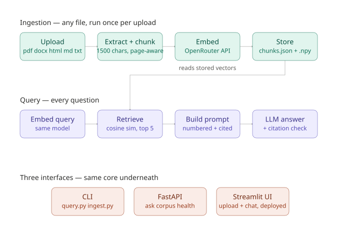

# RAGnarok — a production RAG chatbot over your own documents

A retrieval-augmented chatbot that answers questions strictly from documents you give it — PDF, DOCX, HTML, Markdown, or plain text — with page-level citations back to the source and a measured evaluation of how good its answers actually are. Upload a file through the UI (or point the CLI at one), and it becomes a chatbot for that content, and only that content.



## Status

- [x] Checkpoint 0 — repo scaffolded, environment configured
- [x] Checkpoint 1 — naive pipeline working end-to-end
- [x] Checkpoint 2 — 30-question evaluation set written (`eval_questions.json`)
- [x] Checkpoint 3 — baseline retrieval hit-rate: **90.0% (27/30)**
- [x] Checkpoint 4 — chunking comparison: **96.7% (29/30)** with 1500/300 chunks
- [x] Checkpoint 5 — hybrid retrieval + cross-encoder re-ranking: tested, **underperformed** (86.7% vs 96.7%), not adopted — see below
- [x] Checkpoint 6 — citations (numbered, validated) + refusal handling: **100% (10/10)** on deliberately unanswerable questions
- [x] Checkpoint 7 — FastAPI wrapper (`/ask` `/corpus` `/health`) + in-memory caching + token cost tracking
- [x] Checkpoint 8 — Streamlit UI with real file upload, Dockerized, deployed
- [x] Generalized ingestion to any file (PDF/DOCX/HTML/Markdown/text), not just the reference corpus
- [ ] Demo video

## What it is

RAGnarok is a chatbot you point at a document you own — a PDF, a Word file, a webpage — and it answers questions using only what's actually in that document, showing exactly which page each answer came from. For an engineer: a retrieval-augmented generation pipeline — any document gets extracted to plain text (page-boundary-aware for PDFs), chunked, embedded into vectors, retrieved by cosine similarity at query time, and fed to an LLM as grounding context with mandatory inline citations and a verified refusal fallback when the context doesn't contain the answer.

**Reference corpus:** the FastAPI documentation (`docs/en/docs`, ~155 Markdown files) is what this project was built and rigorously measured against — every retrieval number in this README comes from that corpus and its 30-question eval set. It's the default input if you run `ingest.py` with no arguments, and it's what's baked into the Docker image, so the deployed demo has something to answer immediately. The engine itself doesn't know or care that it's FastAPI docs — run `python ingest.py path/to/anything` (or upload through the UI) and it works the same way on any document. This was proven, not just claimed: tested against a genuinely unrelated 94-page economics paper, including a case where a subtle synthesized claim was manually verified against the raw source text and confirmed accurate.

## Architecture

Three tiers (see diagram above):

**Ingestion (run once per upload)**
any file (PDF/DOCX/HTML/Markdown/text) → extract to plain text (tracking page boundaries for PDFs) → chunk (1500 chars, 300 overlap) → embed (OpenRouter, `text-embedding-3-small`) → store (`chunks.json` + `embeddings.npy`)

**Query (every question)**
question → embed → cosine similarity search (top 5) → build numbered, citation-required prompt → LLM answers (OpenRouter, `gpt-4o-mini`) → validate citations against what was actually retrieved

**Three interfaces, one shared core** — `query.py`'s `retrieve()`/`build_prompt()` and `ingest.py`'s `ingest_path()` are the single source of truth every interface calls:
- `query.py` / `ingest.py` — CLI, direct terminal use
- `api.py` — FastAPI wrapper (`/ask`, `/corpus`, `/health`), in-memory response caching, per-request token tracking
- `app.py` — Streamlit UI: real upload button, per-corpus isolation, chat interface, deployed to Streamlit Community Cloud

| Component | Responsibility | Why this, not the alternative |
|---|---|---|
| `ingest.py` | Multi-format extraction, chunking, embedding, storage | `pypdf`/`python-docx`/`beautifulsoup4` chosen specifically for being lightweight, low-native-dependency-risk — after two separate native-library crises elsewhere in this project, minimizing that risk here was deliberate |
| `query.py` | Retrieval, prompt construction, citation validation — the shared core | Plain NumPy cosine similarity instead of a vector DB — Chroma crashed unrecoverably on Windows, and at this corpus scale brute-force search is sub-millisecond anyway |
| `api.py` | HTTP API, caching, cost tracking | Reuses `query.py`'s functions rather than duplicating logic — the API is a delivery layer, not a second implementation |
| `app.py` | Upload + chat UI | Calls the core functions in-process rather than over HTTP to `api.py` — simpler to containerize and deploy as one service |
| `query_hybrid.py` | BM25 + vector search + cross-encoder re-ranking (preserved, not production) | Rigorously built and tested, measured worse than the simpler pipeline — kept as documented, honest engineering history rather than deleted |

## Setup

```bash
git clone <this repo> && cd RAGnarok
python -m venv venv
venv\Scripts\activate        # Windows
# source venv/bin/activate   # Mac/Linux

pip install -r requirements.txt
cp .env.example .env         # then fill in OPENROUTER_API_KEY
```

## Running

```bash
python ingest.py                              # builds chunks.json/embeddings.npy from the FastAPI reference corpus
python ingest.py path/to/your/document.pdf    # or point it at any file or folder instead

python query.py                # CLI, interactive Q&A loop
uvicorn api:app --reload       # HTTP API — http://localhost:8000/docs for interactive testing
streamlit run app.py           # Full UI with upload button — http://localhost:8501
```

Only one document set is "active" at a time — ingesting a new one overwrites `chunks.json`/`embeddings.npy`. Every entry point prints an **ACTIVE CORPUS** banner on startup (computed live from `chunks.json`, not a separate metadata file that could drift out of sync), so which document is loaded is never ambiguous.

**Docker:**
```bash
docker build -t ragnarok .
docker run -p 8501:8501 -e OPENROUTER_API_KEY=... -e CHAT_MODEL=openai/gpt-4o-mini -e EMBED_MODEL=openai/text-embedding-3-small ragnarok
```

## Evaluation set

`eval_questions.json` — 30 hand-written questions spanning 16 topic areas of the FastAPI docs. Each entry has a `question`, an independently-written `expected_answer`, and the `source_file` that actually contains it — the ground truth Checkpoints 3-5 measure retrieval against.

**Baseline (1000-char chunks):** 86.7% (26/30). One miss turned out to be a flawed question (ambiguous between two valid mechanisms), not a system bug — after fixing it, the same pipeline measured **90.0% (27/30)**.

## Chunking experiment (Checkpoint 4)

| Config | Chunks | Hit-rate | Misses |
|---|---|---|---|
| 1000 / 200 | 1,904 | 90.0% | 4, 15, 23 |
| 500 / 100 | 3,728 | 90.0% | 5, 15, 26 |
| **1500 / 300 (adopted)** | **1,293** | **96.7%** | **15** |

Larger chunks won clearly — more surrounding context meant fewer facts split across a boundary.

## Hybrid retrieval + re-ranking experiment (Checkpoint 5)

| Pipeline | Hit-rate | Misses |
|---|---|---|
| **Production: pure vector search** | **96.7% (29/30)** | 15 |
| Experiment: hybrid BM25 + cross-encoder | 86.7% (26/30) | 1, 4, 8, 15 |

Built and fully tested `query_hybrid.py`. It did not fix the one remaining miss it was built for, and regressed three previously-easy questions — a noisier BM25-widened candidate pool, re-sorted by a small general-purpose cross-encoder, underperformed pure vector search's cleaner top-5. **Kept the simpler pipeline in production.** Getting the cross-encoder running on Windows alone required resolving 5 sequential native-dependency conflicts (see Key decisions) — real, demonstrable work, even though the end result wasn't adopted.

## Citations + refusal (Checkpoint 6)

Every prompt numbers its sources and requires inline citations (`[1]`, `[2]`); `extract_citations()` then checks the answer for citation numbers that don't correspond to anything actually retrieved — flagged as possible fabrication rather than trusted blindly. PDF citations include the actual page number, tracked through chunking via character-offset-to-page mapping (verified against a real multi-page test PDF before shipping).

`refusal_questions.json` — 10 deliberately unanswerable questions, split between obviously unrelated topics and harder, FastAPI-adjacent-but-uncovered ones (Redis rate limiting, a false-premise "who is FastAPI's CEO" trap). `test_refusal.py` measured **100% (10/10)** correct refusals.

## API + caching (Checkpoint 7)

`api.py` — `POST /ask`, `GET /corpus`, `GET /health`, auto-documented at `/docs`. In-memory cache keyed on normalized question text (resets on restart — a real, stated limitation, not hidden). Every response reports actual `prompt_tokens`/`completion_tokens` from OpenRouter's usage data. Measured live: **~2,024 tokens per grounded, cited answer** (1,989 prompt + 35 completion) on a real question against the poverty-paper test corpus.

## Key decisions

| Decision | Considered | Chose | Why | Gave up |
|---|---|---|---|---|
| Vector store | Chroma, Qdrant, pgvector, plain NumPy | Plain NumPy array + JSON | At ~1,300-1,900 chunks, brute-force cosine similarity takes under 1ms — a dedicated vector DB solves a scale problem this project doesn't have. Also sidesteps an unresolved Windows-native crash in Chroma's query engine. | Metadata filtering, incremental updates, graceful scaling past ~100k+ vectors |
| Chunk size/overlap | 1000/200, 500/100, 1500/300 | 1500/300 | Measured 96.7% vs 90.0% hit-rate on the eval set | Slightly more tokens per query |
| Re-ranker (experimental, not production) | Local cross-encoder, LLM-based scoring | Neither adopted | Cross-encoder measured worse (86.7% vs 96.7%) after resolving 5 sequential Windows dependency conflicts to get it running at all. LLM-based scoring worked once fixed (truncation bug, batch-size collapse bug) but was superseded before a full eval run. | The complexity of hybrid retrieval, in exchange for a regression |
| Document parsers | pypdf/pdfplumber, python-docx, various HTML libs | Lightest available option in each category | Minimize native-dependency risk after the cross-encoder's Windows dependency chain | Richer PDF layout/table extraction unavailable in `pypdf` |
| LLM/embedding provider | OpenAI direct, Anthropic direct, OpenRouter | OpenRouter | One key for both chat and embeddings, swappable via `.env` | Free-tier chat models proved unreliable (stale slugs, rate limits) — settled on a cheap paid model with explicitly capped `max_tokens` instead |
| UI-to-core wiring | Streamlit calling `api.py` over HTTP vs. calling core functions directly | Direct, in-process | Single service, one process, simpler to containerize and deploy | `api.py` and `app.py` don't share a running process — each independently imports the same core modules |

## Resume bullet

> Built and deployed RAGnarok, a full-stack RAG chatbot (Python, FastAPI, Streamlit, OpenRouter) answering questions over arbitrary user-uploaded documents (PDF/DOCX/HTML/MD) with page-level citations and verified grounding; raised retrieval hit-rate from 86.7% to 96.7% through a controlled chunking experiment, and validated a hybrid BM25 + cross-encoder pipeline actually underperformed (86.7%) before shipping the simpler, better-measured system instead.

## Credits

- Source reference documents: [fastapi/fastapi](https://github.com/fastapi/fastapi), `docs/en/docs`
- Test PDF: *"What Would it Cost to End Extreme Poverty?"* (Sahoo, Blumenstock, Niehaus, Selker, Wager)
- Project structure and methodology: The Resume Project Vault 2026 (@pratham.codes)
